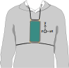
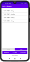

# PrevOccupAI-HAR: A Public Domain Dataset for Smartphone Sensor-based Human Activity Recognition in Office Environments

## 1. Abstract
PrevOccupAI-HAR, presents a new publicly available dataset designed to advance smartphone-based human activity recognition 
(HAR) in office environments. PrevOccupAI-HAR comprises two sub-datasets: (1) a model development dataset collected under 
controlled conditions, featuring 20 subjects performing nine sub-activities associated to three main activity classes 
(sitting, standing, and walking), and (2) a real-world dataset captured in an unconstrained office setting captured 
from 13 subjects carrying out their daily office work for six hours continuously. Three machine learning models, namely 
k-nearest neighbors (KNN), support vector machine (SVM), and random forest, were trained on the model development 
dataset to classify the three main classes independently of sub-activity variation. The models achieved accuracies of 
89.80&nbsp;%, 89.98&nbsp;%, and 92.10&nbsp;% for the KNN, SVM, and Random Forest, respectively, on the development 
dataset. When deployed on the real-world dataset, the models attained mean accuracies of 73.27&nbsp;%, 79.97&nbsp;%, and 
77.20&nbsp;%, reflecting performance degradations between 10.01&nbsp;% and 16.53&nbsp;%. Analysis of sequential 
predictions revealed frequent short-duration misclassifications, predominantly between sitting and standing, resulting 
in unstable model outputs. The findings highlight key challenges in transitioning HAR models from controlled to 
real-world contexts and point to future research directions involving temporal deep learning architectures or 
post-processing methods to enhance prediction consistency.

## 2. Related Publication
The presented code base is part of the journal article "PrevOccupAI-HAR: A Public Domain Dataset for Smartphone 
Sensor-based Human Activity Recognition in Office Environments" submitted to the MDPI special issue "Smart Devices and 
Wearable Sensors: Recent Advances and Prospects". For further details on the methodology, please consider reading the
the publication.

The article can be accessed at: (INSERT LINK ONCE PUBLISHED)

To cite the article please use: (INSERT CITATION ONCE PUBLISHED)

## 3. Dataset

The two sub-datasets used in this repository can be downloaded at: (INSERT LINK ONCE DATASET AVAILABLE)

For both datasets, data was acquired using a Xiamoi Redmi Note 9 smartphone that was strapped to the subject's chest, 
as shown below.
<p align="center">

</p>

The purpose of this placement is: 
1. it allows for tracking human activities.
2. when the subject is seated the trunk movement can be collected, effectively allowing for characterization of seated postures throughout the work day. 
3. this placement can also be utilized as a proxy for development of sensorised garments.

The utilized smartphone runs on the Android operating system (OS) and was used to acquire tri-axial accelerometer (ACC), 
gyroscope (GYR), and magnetometer (MAG) data, as well as rotation vector (ROT) data. ACC, GYR, and ROT were acquired at 
`100 Hz`, while MAG was sampled at `50 Hz` due to restrictions of the Android OS.

A total of 27 subjects participated in the data collection, some of which participated in both datasets. The subject 
details for both datasets, comprising subject ID, sex, age, and participation in which of the datasets, are shown in the
table below.

| Subject ID | Sex | Age (years) | Model development | Model evaluation |
|------------|-----|-------------|-------------------|------------------|
| P001 | F | 22 | ✓ | ✓ |
| P002 | F | 22 | ✓ | ✓ |
| P003 | F | 22 | ✓ | — |
| P004 | F | 54 | ✓ | — |
| P005 | M | 22 | ✓ | ✓ |
| P006 | F | 23 | ✓ | — |
| P007 | F | 20 | ✓ | — |
| P008 | M | 33 | ✓ | ✓ |
| P009 | M | 23 | ✓ | — |
| P010 | F | 22 | ✓ | — |
| P011 | F | 24 | ✓ | — |
| P012 | M | 24 | ✓ | ✓ |
| P013 | F | 21 | ✓ | — |
| P014 | F | 24 | ✓ | — |
| P015 | F | 28 | ✓ | ✓ |
| P016 | F | 19 | ✓ | — |
| P017 | M | 40 | ✓ | — |
| P018 | F | 21 | ✓ | — |
| P019 | F | 27 | ✓ | — |
| P020 | M | 41 | ✓ | — |
| P021 | F | 23 | — | ✓ |
| P022 | F | 23 | — | ✓ |
| P023 | F | 23 | — | ✓ |
| P024 | F | 18 | — | ✓ |
| P025 | F | 23 | — | ✓ |
| P026 | M | 22 | — | ✓ |
| P027 | M | 25 | — | ✓ |


### 3.1 Model Development Dataset
#### 3.1.1 General Description
The Model Development dataset (MD) consists of 20 healthy subjects, comprising 14 women and six men, aged between 19 and 
54 years (27 $\pm$ 3.7 years). The dataset contains nine sub-activities that can be associated to three main activities,
namely sitting, standing, and walking. The acquired sub-activities and their correspondence to the respective main 
activity are shown below.

<p align="center">

</p>

#### 3.1.2 Dataset Structure
The MD dataset is organized hierarchically by participant and activity-related recording sessions.
```text
model_development/
├── P001/
│   ├── cabinets/
│   │   ├── opensignals_ANDROID_ACCELEROMETER_2024-04-08_17-37-29.txt
│   │   ├── opensignals_ANDROID_GYROSCOPE_2024-04-08_17-37-29.txt
│   │   ├── opensignals_ANDROID_MAGNETIC_FIELD_2024-04-08_17-37-29.txt
│   │   └── opensignals_ANDROID_ROTATION_VECTOR_2024-04-08_17-37-29.txt
│   ├── sitting/
│   │   ├── ...
│   ├── stairs/
│   │   ├── ...
│   ├── standing/
│   │   ├── ...
│   └── walking/
│       ├── ...
├── P002/
│   ├── .../
│   ├── .../
│   ├── .../
│   ├── .../
│   └── .../
├── .../
```
__Activity-Related Recording Folders:__  
Within each participant folder:
* Separate folders are provided for recordings that contain activities that thematically have been recorded together:  `cabinets/`, `sitting/`, `stairs/`, `standing/`, and `walking/`
* Each folder contains the raw smartphone sensor signals recorded during that recording, stored as `.txt` files.

__Activity-Related Recordings:__  
Similar sub-activities were grouped to form five activity-specific recording sessions. Each session consisted of clearly 
defined segments, during which participants were instructed to perform a specific sub-activity following a standardized 
acquisition protocol.

_Acquisition and Segmentation Protocol_
1. At the beginning of each recording session, each subject performed approximately ten jumps for synchronization purposes. 

To facilitate the segmentation of the sub-activities performed within te same session, short pauses were introduced 
between segments. These pauses were:
2. ten-seconds stops (no movement) for activities associated with walking.
3. ten-seconds stops with a jump in the middle for activities performed while standing. 

The described segmentation patterns are shown in the figure below.

<p align="center">

</p>

_Recording Sessions_  
Each of the five recording sessions corresponds to one activity-related folder contained within each participant directory.

`cabinets/`:  
This session contains __two standing tasks__ involving cabinet-related activities, each lasting 07:30 min (total 15 min): 
1. Simulation of preparing and drinking coffe or tea. 
2. Organizing items such as folders, papers, and boxes inside the cabinet.

`sitting/`:  
This session contains data while participants were sitting and working at a computer for 15 min.

`stairs/`:  
This session comprises __alternating__ stairs ascend and descent (total 5 min):
* Participants __P002, P004, and P007__ performed eight segments (four ascents and four descents, i.e, up, down, up, down, etc.) of approx. 35 seconds each.
* __All other participants__ performed (two stair ascents and two descents), each lasting 01:15 min.

`standing/:`  
This sessions consists of __two standing task__, each lasting  07:30 min (total 15 min)
1. standing still. For participant comfort, this task was split into two segments recorded at the beginning and the end of the session.
2. standing while conversing. Participants were instructed to stand naturally, simulating situations such as waiting for an elevator, a colleague, or in outside a meeting room.

`waking/:`  
This session involved participants walking at three paces on even and stable ground. Each walking speed was recorded for 
05:00 min (total 15 minutes):
1. walking slow
2. walking medium
3. walking fast

__Sensor Data Files:__  
Each session sub-folder contains the raw smartphone sensor signals stores as `.txt` files. The naming convention for 
sensor files is `opensignals_ANDROID_{SENSOR_NAME}_YYYY-MM-DD_HH-MM-SS.txt`, where `{SENSOR_NAME}` corresponds to one of the 
following smartphone sensors:
* `ACCELEROMETER`
* `GYROSCOPE`
* `MAGNETIC_FIELD`
* `ANDROID_ROTATION_VECTOR`

### 3.2 Model Evaluation Dataset
#### 3.2.1 General Description
The model Evaluation Dataset (ME) contains data from 13 healthy subjects, eight women and five men, aged between 18 and 
34 years (24.2 $\pm$ 3.7 years). For this dataset, subjects carried out their daily work activities for roughly six hours.
No specific instructions were given to the subjects during the data acquisition. Instead, they were encouraged to carry 
out their daily work tasks while labeling the three main activities: sitting, standing, and walking, using an Android 
application developed for this study. The application generates a .txt file that contains the time, in the format 
"HH:MM:SS.ms", and the corresponding activity that is logged via a button press. Participants were indicated to press 
the corresponding activity button once an activity was initiated. A screenshot of the application is provided below.

<p align="center">

</p>

Given the delay that results from reaction times of pressing the button, and the potential of forgetting to label or 
mislabeling, the generated files were inspected and corrected by two separate experts by visualizing the labels together
with the corresponding signals, namely the y-axis of the ACC. The correction consisted of aligning the labels with the 
onset of each activity.

#### 3.2.2 Dataset Structure
The ME dataset is organized hierarchically by participant and recording session.

__Directory Layout:__
```text
model_evaluation/
├── P001/
│   ├── 2025-05-26_09-50-02/
│   │   ├── opensignals_ANDROID_ACCELEROMETER_2025-05-26_09-50-02.txt
│   │   ├── opensignals_ANDROID_GYROSCOPE_2025-05-26_09-50-02.txt
│   │   ├── opensignals_ANDROID_MAGNETIC_FIELD_2025-05-26_09-50-02.txt
│   │   └── opensignals_ANDROID_ROTATION_VECTOR_2025-05-26_09-50-02.txt
│   └── 20250526_activity_log.txt
├── P002/
│   ├── .../
│   └── ...
├── .../
```
__Recording Sessions:__  
Within each participant folder:
* Each recording session is stored in a sub-folder named using the format `YYYY-MM-DD_HH-MM-SS`, corresponding to the date and start time of the recording (e.g., `2025-05-26_09-50-02`).
* A session-level label file named `YYYYMMDD_activity_log.txt` (e.g., `20250526_activity_log.txt`) contains the activity annotations for that participant.

__Sensor Data Files:__  
Each session sub-folder contains the raw smartphone sensor signals stores as `.txt` files. The naming convention for 
sensor files is `opensignals_ANDROID_{SENSOR_NAME}_YYYY-MM-DD_HH-MM-SS.txt`, where `{SENSOR_NAME}` corresponds to one of the 
following smartphone sensors:
* `ACCELEROMETER`
* `GYROSCOPE`
* `MAGNETIC_FIELD`
* `ANDROID_ROTATION_VECTOR`

## 4. Repository
### 4.1. Purpose
This repository contains code to perform the following tasks described in the accompanying article:
1. __Data Segmentation:__ segmenting the data contained in the MD dataset into the sub-activities, ensuring that each segment is pure (i.e., only contains data related to that sub-activity).
2. __Feature Extraction:__ windowing the segmented data and extracting features from each window.
3. __Model Development:__ training and testing baseline machine learning models (KNN, SVM, and Random Forest) on the features extracted from the MD dataset.
4. __Model Evaluation:__ evaluating the trained model on the ME dataset. 

### 4.2. Repository Structure
The repository is structured around three modules, each handling corresponding to one stage of the processing pipeline:
* `raw_data_processor`: handles data loading, data cleaning, sensor alignment, data pre-processing, and segmentation.
* `feature_extractor`: handles windowing and feature extraction
* `HAR`: handles training the three baseline models (KNN, SVM, and Random Forest) on the MD dataset and evaluating (deploying) them on the ME dataset.

The overall workflow is run through `main.py`.

### 4.3 Reproducing Experiments
To reproduce the experiments presented in the article, follow these steps:

1. Download the Datasets.
2. Create an output directory (e.g., 'HAR_ouput') to store MD dataset segmentation and feature extraction, as well as the model results for the MD and ME dataset.
3. Run the main file using the following arguments, as shown below (paths are examples and should be adapted to the local setup):

```bash
python main.py --MD_dataset_path "E:\Prevoccupai_HAR\model_development" --ME_dataset_path "E:\Prevoccupai_HAR\model_evaluation" --output_path "E:\Prevoccupai_HAR\HAR_output"
```

When running the code, three folders are generated inside the defined output directory:
* `segmented_data/`: contains the segmented (isolated) sub-activities, stored as `.npy` files, for each subject, along with a `numpy_columns.json` file describing the column structure of the stored `.npy` arrays.
* `extracted_features/`: contains the extracted features for each subject as `.npy` files, as well as a `class_instances.json` file reporting the extracted features and the number of instances per main and sub-activity (class). This file is used to perform class balancing.
* `results/`: contains the results for the MD and the ME datasets, respectively. The MD results contain the performance metrics (`.csv` file and confusion matrix) for each model as well as the trained models stored in `.joblib` files. The ME results contain the performance metrics of all three models and plots displaying the model output vs. the true labels for each subject.


